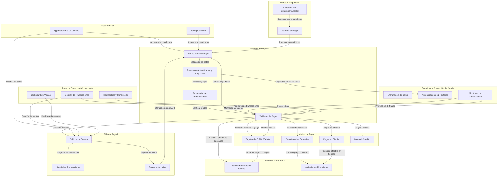
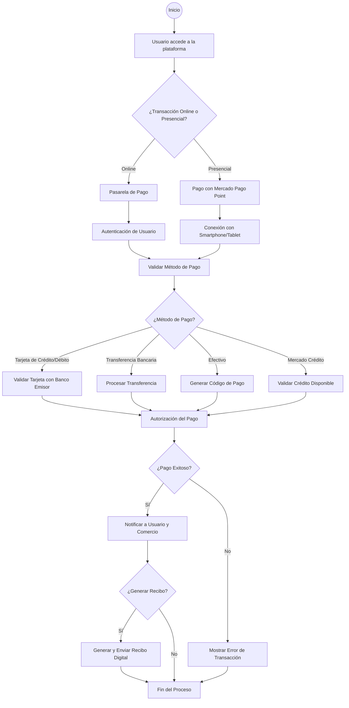
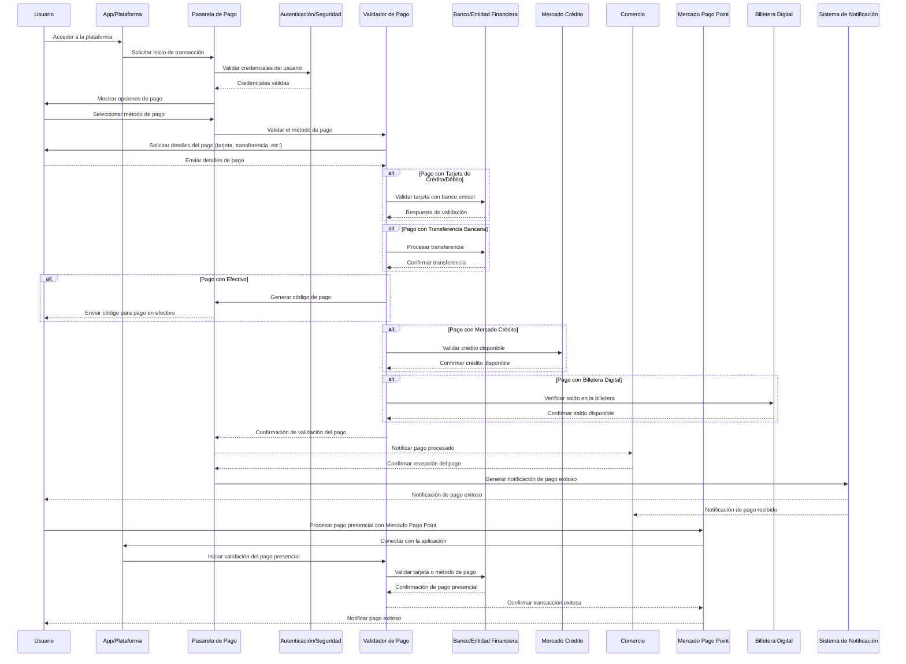
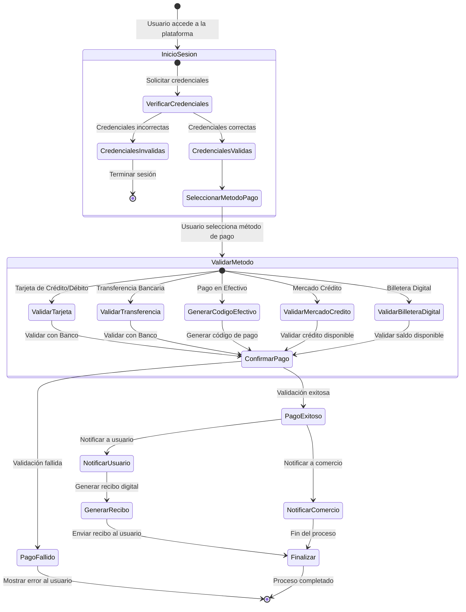

# Mercado Pago

Mercado Pago es una plataforma de pagos en línea popular en América Latina, que forma parte del ecosistema de Mercado Libre. Permite a los negocios y usuarios realizar transacciones de manera flexible y segura.

## Tabla de Contenido

1. [Funcionalidades de Mercado Pago](#funcionalidades-de-mercado-pago)
2. [Cómo funciona para comercios](#cómo-funciona-para-comercios)
3. [Cómo funciona para usuarios](#cómo-funciona-para-usuarios)
4. [Ventajas de Mercado Pago](#ventajas-de-mercado-pago)
5. [Componentes Principales de Mercado Pago](#componentes-principales-de-mercado-pago)
6. [Actores Involucrados en Mercado Pago](#actores-involucrados-en-mercado-pago)
7. [Relación entre Componentes y Actores](#relación-entre-componentes-y-actores)
8. [Diagramas Técnicos](#diagramas-técnicos)

## Funcionalidades de Mercado Pago
- **Aceptación de Pagos**: Acepta tarjetas de crédito, pagos en efectivo, transferencias bancarias y financiamiento a través de Mercado Crédito.
- **Mercado Pago Point**: Permite pagos presenciales con tarjetas a través de dispositivos conectados a smartphones.
- **Botón de Pago y Checkout**: Facilita la integración en tiendas en línea con opciones de pago personalizadas.
- **Pagos QR**: Los usuarios pueden pagar en tiendas físicas escaneando códigos QR.
- **Envío de dinero**: Transferencias entre personas sin costo o con comisiones bajas.
- **Billetera digital**: Los usuarios almacenan saldo para compras y pagos de servicios.

## Cómo funciona para comercios
Los comerciantes crean una cuenta, integran la pasarela de pagos en su tienda y gestionan las comisiones por transacción.

## Cómo funciona para usuarios
Los usuarios eligen Mercado Pago como método de pago en línea, usando la app para enviar dinero y pagar servicios.

## Ventajas de Mercado Pago
- **Seguridad**: Protocolos de seguridad avanzados.
- **Facilidad de uso**: Intuitiva y fácil de integrar.
- **Aceptación**: Amplia utilización en América Latina.
- **Opciones de financiamiento**: Posibilidad de pagar en cuotas.

## Componentes Principales de Mercado Pago
- **Pasarela de Pago**: Intermediario en transacciones.
- **API y Plugins**: Herramientas para integración.
- **Billetera Digital**: Almacenamiento de fondos.
- **Pagos QR**: Facilita pagos físicos.
- **Mercado Crédito**: Financiamiento para usuarios.
- **Panel de Control**: Monitoreo de ventas y transacciones.
- **Seguridad y Prevención de Fraude**: Múltiples protocolos de seguridad.

## Actores Involucrados en Mercado Pago
- **Usuarios**: Realizan compras y envían dinero.
- **Comercios**: Venden productos y gestionan pagos.
- **Entidades Financieras**: Procesan autorizaciones de pago.
- **Mercado Pago**: Opera la plataforma.
- **Mercado Crédito**: Ofrece líneas de crédito.
- **Proveedores de Infraestructura**: Soporte técnico y de seguridad.
- **Reguladores**: Supervisan operaciones financieras.

## Relación entre Componentes y Actores
Interacciones entre usuarios, comercios, Mercado Pago y entidades financieras para facilitar las transacciones y asegurar la protección de datos.

## Diagramas Técnicos
### Diagrama de Arquitectura

#### Descripción del Diagrama Arquitectura de Software:
- Usuario Final accede a Mercado Pago a través de la aplicación móvil o el navegador web.
- La Pasarela de Pago (API de Mercado Pago) gestiona la interacción de usuarios, comercios y métodos de pago.
- El Proceso de Autenticación y Seguridad asegura que todas las transacciones sean verificadas mediante autenticación y encriptación.
- La Billetera Digital permite a los usuarios almacenar saldo, pagar servicios y consultar el historial de transacciones.
- Mercado Pago Point permite a los comerciantes aceptar pagos físicos mediante terminales conectadas a smartphones o tablets.
- Los Medios de Pago incluyen tarjetas, transferencias bancarias, pagos en efectivo, y Mercado Crédito.
- Las Entidades Financieras validan las transacciones con los bancos emisores de tarjetas y otros proveedores financieros.
- El Panel de Control del Comerciante ofrece a los vendedores la posibilidad de gestionar ventas, transacciones y reembolsos.
- Seguridad y Prevención de Fraude monitorea las transacciones y asegura la integridad de los datos.

### Diagrama de Flujo

#### Descripción del diagrama de flujo:
- Inicio del Flujo: El usuario accede a la plataforma de Mercado Pago (app o web).
- Decisión Inicial: Se determina si la transacción es online (en una tienda web) o presencial (en un comercio físico usando Mercado Pago Point).
    - Si es online, el proceso se dirige a la pasarela de pago, donde se autentica al usuario y se valida el método de pago.
    - Si es presencial, se usa Mercado Pago Point, conectándose a un dispositivo móvil.
- Validación del Método de Pago: El flujo sigue según el método de pago elegido:
    - Tarjeta de Crédito/Débito: Se valida la tarjeta con el banco emisor.
    - Transferencia Bancaria: Se procesa la transferencia.
    - Efectivo: Se genera un código de pago que el usuario puede usar para pagar en un punto autorizado.
    - Mercado Crédito: Se valida si el usuario tiene crédito disponible.
- Procesamiento del Pago: Todos los métodos de pago llevan al mismo punto donde se autoriza la transacción.
- Confirmación del Pago: Si el pago es exitoso, el usuario y el comercio reciben una notificación. Si falla, se muestra un error.
- Opciones Post-pago: Se decide si se genera un recibo digital. Si se genera, se envía al usuario.
- Fin del Flujo: El proceso finaliza, ya sea tras el pago exitoso o un error de transacción.

## Diagrama de Secuencia

#### Descripción del diagrama de secuencia:
- Usuario accede a la plataforma de Mercado Pago (a través de la app o navegador) y comienza una transacción.
- Pasarela de Pago se encarga de la comunicación inicial y valida las credenciales del usuario mediante el sistema de Autenticación/Seguridad.
- El usuario selecciona su método de pago (tarjeta, transferencia, efectivo, crédito, o billetera digital), y la Pasarela de Pago envía esta solicitud al Validador de Pago.
- Dependiendo del método de pago seleccionado:
    - Se valida con un Banco (tarjeta o transferencia),
    - Se genera un código de pago (efectivo),
    - Se valida el saldo de la Billetera Digital,
O se comprueba el crédito disponible mediante Mercado Crédito.
- El Validador de Pago confirma la transacción y notifica tanto al Comercio como al Usuario sobre el estado del pago.
- Si es una transacción presencial, el pago se realiza a través de Mercado Pago Point, que interactúa con la app y pasa por un proceso similar de validación de pago, conectando con los sistemas relevantes para verificar la transacción.
- El sistema de Notificación informa tanto al usuario como al comercio sobre el éxito de la transacción.

## Diagrama de Estados

#### Explicación del diagrama de estados:
- Inicio del Estado: El diagrama comienza con el inicio de sesión del usuario en la plataforma de Mercado Pago. El sistema verifica las credenciales del usuario.
- Selección del Método de Pago: Una vez autenticado, el usuario selecciona un método de pago. El sistema pasa a la fase de validación del método.
- Validación de Métodos de Pago:
	- Si el usuario selecciona tarjeta de crédito/débito, el sistema valida con el banco.
	- Si selecciona transferencia bancaria, se verifica la transacción.
	- En el caso de efectivo, el sistema genera un código de pago.
	- Si es Mercado Crédito, se valida el crédito disponible.
	- Si se usa la billetera digital, se verifica el saldo disponible.
- Confirmación de Pago: Según los resultados de la validación del método de pago, el estado puede ir a:
	- Pago Exitoso, lo que desencadena la notificación al usuario y al comercio.
	- Pago Fallido, en cuyo caso se muestra un error y el proceso termina.
	- Notificación: En el caso de un pago exitoso, el sistema genera un recibo digital y lo envía al usuario, finalizando el proceso.
	- Finalización: Una vez que todas las partes han sido notificadas y el recibo ha sido enviado, el proceso se marca como completado.

Este diagrama de estados muestra el ciclo de vida de una transacción dentro de Mercado Pago, desde el inicio de sesión hasta la finalización, incluyendo la - selección y validación de métodos de pago, y las notificaciones correspondientes.